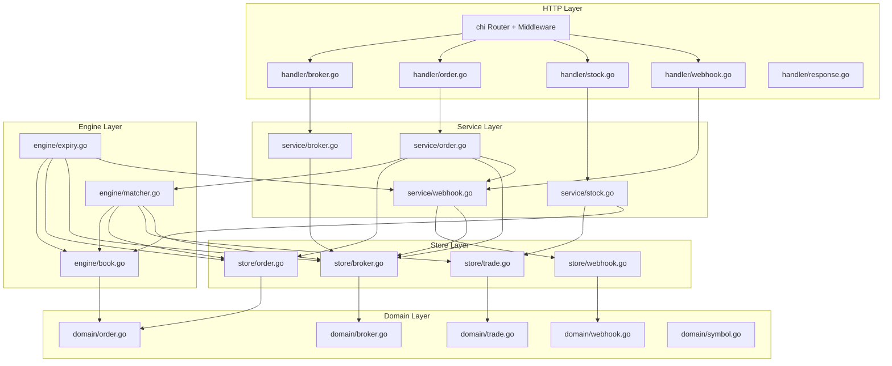
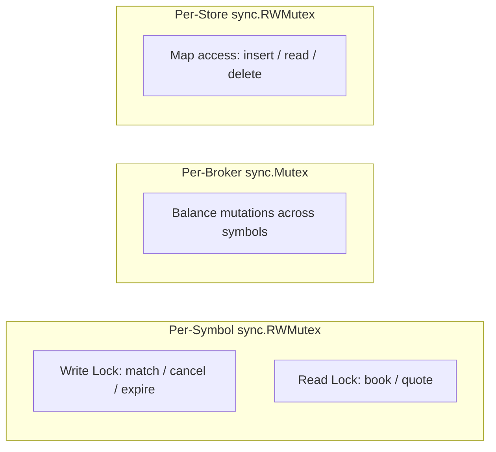

# Design Document: Mini Stock Exchange

## Overview

This document describes the technical design for a mini Stock Exchange system implemented in Go. The system receives orders from brokers, matches them using a Central Limit Order Book (CLOB) per symbol, and executes trades. All state is held in-memory. The authoritative source for all implementation details is `design-documents/system-design-spec.md`.

**Stack**: Go ≥ 1.23, module `github.com/efreitasn/miniexchange`
**Dependencies**: `github.com/google/btree` v2 (order book B-trees), `github.com/google/uuid` v1 (UUIDs), `github.com/go-chi/chi/v5` (HTTP router), stdlib `log/slog`
**Deployment**: Multi-stage Docker build → distroless final image

## Architecture

The system follows a layered architecture with strict dependency direction: handlers → services → engine/stores → domain.



**Layer responsibilities**:
- `cmd/miniexchange/main.go` — Config loading, dependency wiring, server startup, graceful shutdown. No business logic.
- `internal/domain/` — Pure data types and constants. No side effects, no dependencies on other packages.
- `internal/store/` — In-memory thread-safe CRUD. Maps protected by `sync.RWMutex`. No business logic.
- `internal/engine/` — Matching engine, order book B-trees, expiration loop. Depends on domain and store.
- `internal/service/` — Orchestration: validation, engine calls, webhook dispatch. Depends on domain, store, engine.
- `internal/handler/` — HTTP layer: request parsing, service calls, JSON responses. Depends on service and domain only.

### Concurrency Model



- Per-symbol `sync.RWMutex`: write lock for matching, cancellation, expiration. Read lock for book/quote queries.
- Per-broker `sync.Mutex`: guards balance fields (`cash_balance`, `reserved_cash`, holdings). Acquired/released sequentially per broker — never nested — so deadlock is impossible.
- Per-store `sync.RWMutex`: protects map access in BrokerStore, OrderStore, TradeStore, WebhookStore.
- Different symbols are fully independent — orders for AAPL and GOOG process concurrently.

## Components and Interfaces

### Domain Types (`internal/domain/`)


```go
// domain/broker.go
type Broker struct {
    BrokerID     string
    CashBalance  int64              // total cash in cents
    ReservedCash int64              // cash locked by active bid orders
    Holdings     map[string]*Holding // symbol → holding
    CreatedAt    time.Time
    Mu           sync.Mutex         // per-broker lock for balance mutations
}

type Holding struct {
    Quantity         int64
    ReservedQuantity int64
}

// domain/order.go
type OrderType string
const (
    OrderTypeLimit  OrderType = "limit"
    OrderTypeMarket OrderType = "market"
)

type OrderSide string
const (
    OrderSideBid OrderSide = "bid"
    OrderSideAsk OrderSide = "ask"
)

type OrderStatus string
const (
    OrderStatusPending         OrderStatus = "pending"
    OrderStatusPartiallyFilled OrderStatus = "partially_filled"
    OrderStatusFilled          OrderStatus = "filled"
    OrderStatusCancelled       OrderStatus = "cancelled"
    OrderStatusExpired         OrderStatus = "expired"
)

type Order struct {
    OrderID            string
    Type               OrderType
    BrokerID           string
    DocumentNumber     string
    Side               OrderSide
    Symbol             string
    Price              int64       // cents, 0 for market orders
    Quantity           int64
    FilledQuantity     int64
    RemainingQuantity  int64
    CancelledQuantity  int64
    Status             OrderStatus
    ExpiresAt          *time.Time  // nil for market orders
    CreatedAt          time.Time
    CancelledAt        *time.Time
    ExpiredAt          *time.Time
    Trades             []*Trade
}

// domain/trade.go
type Trade struct {
    TradeID    string
    OrderID    string
    Price      int64     // cents
    Quantity   int64
    ExecutedAt time.Time
}

// domain/webhook.go
type Webhook struct {
    WebhookID string
    BrokerID  string
    Event     string
    URL       string
    CreatedAt time.Time
    UpdatedAt time.Time
}
```

### Store Interfaces (`internal/store/`)

Each store is a thin thread-safe wrapper around Go maps. No business logic — just CRUD and indexing.

| Store | Primary Index | Secondary Indexes |
|---|---|---|
| `BrokerStore` | `map[string]*domain.Broker` keyed by `broker_id` | None |
| `OrderStore` | `map[string]*domain.Order` keyed by `order_id` | `map[string][]*domain.Order` keyed by `broker_id` |
| `TradeStore` | `map[string][]*domain.Trade` keyed by `symbol` (append-only, chronological) | None |
| `WebhookStore` | `map[string]*domain.Webhook` keyed by `webhook_id` | `map[string]map[string]*domain.Webhook` keyed by `broker_id → event` |

```go
// store/broker.go
type BrokerStore struct {
    mu      sync.RWMutex
    brokers map[string]*domain.Broker
}
func (s *BrokerStore) Create(b *domain.Broker) error    // returns error if exists
func (s *BrokerStore) Get(id string) (*domain.Broker, error)
func (s *BrokerStore) Exists(id string) bool

// store/order.go
type OrderStore struct {
    mu           sync.RWMutex
    orders       map[string]*domain.Order
    brokerOrders map[string][]*domain.Order  // broker_id → orders
}
func (s *OrderStore) Create(o *domain.Order)
func (s *OrderStore) Get(id string) (*domain.Order, error)
func (s *OrderStore) ListByBroker(brokerID string, status *domain.OrderStatus, page, limit int) ([]*domain.Order, int)

// store/trade.go
type TradeStore struct {
    mu     sync.RWMutex
    trades map[string][]*domain.Trade  // symbol → trades (chronological)
}
func (s *TradeStore) Append(symbol string, t *domain.Trade)
func (s *TradeStore) GetBySymbol(symbol string) []*domain.Trade

// store/webhook.go
type WebhookStore struct {
    mu       sync.RWMutex
    webhooks map[string]*domain.Webhook
    byBroker map[string]map[string]*domain.Webhook  // broker_id → event → webhook
}
func (s *WebhookStore) Upsert(w *domain.Webhook) (created bool)
func (s *WebhookStore) Get(id string) (*domain.Webhook, error)
func (s *WebhookStore) ListByBroker(brokerID string) []*domain.Webhook
func (s *WebhookStore) Delete(id string) error
func (s *WebhookStore) GetByBrokerEvent(brokerID, event string) *domain.Webhook
```

### Engine (`internal/engine/`)

#### Order Book (`engine/book.go`)

```go
type OrderBookEntry struct {
    Price     int64
    CreatedAt time.Time
    OrderID   string
    Order     *domain.Order
}

type OrderBook struct {
    symbol    string
    mu        sync.RWMutex
    bids      *btree.BTreeG[OrderBookEntry]  // price DESC, created_at ASC, order_id ASC
    asks      *btree.BTreeG[OrderBookEntry]  // price ASC, created_at ASC, order_id ASC
    index     map[string]OrderBookEntry       // order_id → entry (for O(log n) removal)
}

func (ob *OrderBook) InsertBid(entry OrderBookEntry)
func (ob *OrderBook) InsertAsk(entry OrderBookEntry)
func (ob *OrderBook) Remove(orderID string)
func (ob *OrderBook) BestBid() (OrderBookEntry, bool)
func (ob *OrderBook) BestAsk() (OrderBookEntry, bool)
func (ob *OrderBook) TopBids(n int) []PriceLevel
func (ob *OrderBook) TopAsks(n int) []PriceLevel
func (ob *OrderBook) WalkAsks(fn func(OrderBookEntry) bool)  // for market buy simulation
func (ob *OrderBook) WalkBids(fn func(OrderBookEntry) bool)  // for market sell simulation
```

#### Matcher (`engine/matcher.go`)

```go
type BookManager struct {
    books map[string]*OrderBook  // symbol → book
    mu    sync.RWMutex           // protects the books map itself
}

type Matcher struct {
    books       *BookManager
    brokerStore *store.BrokerStore
    orderStore  *store.OrderStore
    tradeStore  *store.TradeStore
}

func (m *Matcher) MatchLimitOrder(order *domain.Order) ([]*domain.Trade, error)
func (m *Matcher) MatchMarketOrder(order *domain.Order) ([]*domain.Trade, error)
func (m *Matcher) CancelOrder(orderID string) (*domain.Order, error)
func (m *Matcher) SimulateMarketOrder(symbol string, side domain.OrderSide, quantity int64) *QuoteResult
```

#### Expiry (`engine/expiry.go`)

```go
type ExpiryManager struct {
    interval    time.Duration
    books       *BookManager
    orderStore  *store.OrderStore
    brokerStore *store.BrokerStore
    webhookSvc  WebhookDispatcher  // interface for webhook dispatch
    activeOrders []*domain.Order   // sorted by expires_at ASC
    mu           sync.Mutex        // protects activeOrders slice
}

func (e *ExpiryManager) Add(order *domain.Order)
func (e *ExpiryManager) Remove(orderID string)
func (e *ExpiryManager) Start(ctx context.Context)
func (e *ExpiryManager) tick(now time.Time)
```

The expiry goroutine runs on a configurable interval (default 1s). On each tick, it iterates the sorted slice from the front, expiring all orders where `expires_at <= now`. For each expired order, it acquires the per-symbol write lock, transitions the order to `expired`, releases reservations, removes from the book, and fires webhooks.

### Service Layer (`internal/service/`)

```go
// service/broker.go
type BrokerService struct {
    store *store.BrokerStore
}
func (s *BrokerService) Register(req RegisterBrokerRequest) (*domain.Broker, error)
func (s *BrokerService) GetBalance(brokerID string) (*BalanceResponse, error)

// service/order.go
type OrderService struct {
    matcher     *engine.Matcher
    expiry      *engine.ExpiryManager
    brokerStore *store.BrokerStore
    orderStore  *store.OrderStore
    webhookSvc  *WebhookService
}
func (s *OrderService) SubmitOrder(req SubmitOrderRequest) (*domain.Order, error)
func (s *OrderService) GetOrder(orderID string) (*domain.Order, error)
func (s *OrderService) CancelOrder(orderID string) (*domain.Order, error)
func (s *OrderService) ListOrders(brokerID string, status *domain.OrderStatus, page, limit int) ([]*domain.Order, int, error)

// service/stock.go
type StockService struct {
    tradeStore *store.TradeStore
    books      *engine.BookManager
    vwapWindow time.Duration
    symbols    *SymbolRegistry
}
func (s *StockService) GetPrice(symbol string) (*PriceResponse, error)
func (s *StockService) GetBook(symbol string, depth int) (*BookResponse, error)
func (s *StockService) GetQuote(symbol string, side domain.OrderSide, quantity int64) (*QuoteResponse, error)

// service/webhook.go
type WebhookService struct {
    store       *store.WebhookStore
    brokerStore *store.BrokerStore
    client      *http.Client
}
func (s *WebhookService) Upsert(req UpsertWebhookRequest) ([]*domain.Webhook, bool, error)
func (s *WebhookService) List(brokerID string) ([]*domain.Webhook, error)
func (s *WebhookService) Delete(webhookID string) error
func (s *WebhookService) DispatchTradeExecuted(brokerID string, trade *domain.Trade, order *domain.Order)
func (s *WebhookService) DispatchOrderExpired(order *domain.Order)
func (s *WebhookService) DispatchOrderCancelled(order *domain.Order)
```

### Handler Layer (`internal/handler/`)

Handlers parse HTTP requests, call services, and write JSON responses. They never access stores or the engine directly.

```go
// handler/router.go
func NewRouter(
    brokerSvc *service.BrokerService,
    orderSvc  *service.OrderService,
    stockSvc  *service.StockService,
    webhookSvc *service.WebhookService,
    logger    *slog.Logger,
) chi.Router

// Routes:
// POST   /brokers
// GET    /brokers/{broker_id}/balance
// GET    /brokers/{broker_id}/orders
// POST   /orders
// GET    /orders/{order_id}
// DELETE /orders/{order_id}
// GET    /stocks/{symbol}/price
// GET    /stocks/{symbol}/book
// GET    /stocks/{symbol}/quote
// POST   /webhooks
// GET    /webhooks
// DELETE /webhooks/{webhook_id}
// GET    /healthz
```

### Configuration (`internal/config/`)

```go
type Config struct {
    Port               int
    LogLevel           string
    ExpirationInterval time.Duration
    WebhookTimeout     time.Duration
    VWAPWindow         time.Duration
    ReadTimeout        time.Duration
    WriteTimeout       time.Duration
    IdleTimeout        time.Duration
    ShutdownTimeout    time.Duration
}

func Load() (*Config, error)  // reads env vars, applies defaults, validates
```

### Symbol Registry

Symbols are implicitly registered when they appear in any order submission or in a broker's `initial_holdings`. A simple thread-safe `map[string]bool` tracks known symbols. The `GET /stocks/{symbol}/*` endpoints return `404` for unknown symbols.

## Data Models

### Internal Representation

All monetary values are stored as `int64` cents internally. `$148.50` → `14850`. Conversion happens at the API boundary:
- Input: `float64` JSON number → validate ≤ 2 decimal places → multiply by 100 → `int64`
- Output: `int64` → divide by 100.0 → `float64` JSON number (always 2 decimal places)

All timestamps are `time.Time` internally with full nanosecond precision. Serialized to JSON as RFC 3339 with second-level granularity (`2026-02-17T19:00:00Z`).

### Order Book B-Tree Keys

**Bid side** (best bid = minimum entry due to inverted price comparison):
```
Less(a, b): a.Price > b.Price || (a.Price == b.Price && a.CreatedAt < b.CreatedAt) || (... && a.OrderID < b.OrderID)
```

**Ask side** (best ask = minimum entry):
```
Less(a, b): a.Price < b.Price || (a.Price == b.Price && a.CreatedAt < b.CreatedAt) || (... && a.OrderID < b.OrderID)
```

The `order_id` tiebreaker ensures unique keys and fully deterministic ordering.

### Matching Engine Settlement

For each trade during a match:
- **Buyer**: `cash_balance -= execution_price × fill_qty`, `reserved_cash -= bid_order.price × fill_qty`, holdings[symbol] += fill_qty
- **Seller**: `cash_balance += execution_price × fill_qty`, holdings[symbol] -= fill_qty, `reserved_quantity -= fill_qty`
- Price improvement: `(bid_order.price - execution_price) × fill_qty` returns to buyer's `available_cash`

### Expiration Secondary Index

A slice of pointers to active on-book orders, sorted by `expires_at` ascending. Orders are appended when placed on the book and removed when they leave (fill, cancel, expire). The expiration goroutine iterates from the front, stopping at the first non-expired order.

### VWAP Computation

`TradeStore` stores trades per symbol in chronological order. VWAP iterates backwards from the tail until `executed_at` falls outside the window:
```
vwap = sum(trade.price * trade.quantity) / sum(trade.quantity)
```
Fallback: if no trades in window, use the last trade's price. If no trades ever, return `null`.


## Correctness Properties

*A property is a characteristic or behavior that should hold true across all valid executions of a system — essentially, a formal statement about what the system should do. Properties serve as the bridge between human-readable specifications and machine-verifiable correctness guarantees.*

### Property 1: Broker registration round-trip

*For any* valid broker registration request (valid broker_id, initial_cash ≥ 0, valid holdings), creating the broker and then retrieving the balance should return the same cash_balance and holdings quantities that were provided at registration.

**Validates: Requirements 1.1, 1.5**

### Property 2: Broker uniqueness

*For any* broker_id, registering a broker and then attempting to register again with the same broker_id should fail with a conflict error, regardless of the other fields in the second request.

**Validates: Requirements 1.2**

### Property 3: Broker input validation

*For any* broker registration request with at least one invalid field (broker_id not matching `^[a-zA-Z0-9_-]{1,64}$`, initial_cash < 0, initial_cash with > 2 decimal places, symbol not matching `^[A-Z]{1,10}$`, quantity ≤ 0, duplicate symbols), the request should be rejected with a 400 error.

**Validates: Requirements 1.3, 1.4**

### Property 4: Order book sorting invariant

*For any* sequence of limit orders inserted into the same symbol's book, iterating the bid side should yield entries in order of price descending then created_at ascending then order_id ascending, and iterating the ask side should yield entries in order of price ascending then created_at ascending then order_id ascending.

**Validates: Requirements 4.1**

### Property 5: Price compatibility determines matching

*For any* bid order and ask order on the same symbol, a trade occurs if and only if `bid.price >= ask.price`. When the best bid is less than the best ask, no matching occurs and the book remains uncrossed.

**Validates: Requirements 4.2**

### Property 6: Execution price rule

*For any* matched pair of orders, the execution price equals the ask (seller) price. For limit-vs-limit matches, this is the resting or incoming ask's price. For market orders, this is the resting limit order's price.

**Validates: Requirements 4.3, 4.4**

### Property 7: Quantity conservation

*For any* order at any point in time, `quantity == filled_quantity + remaining_quantity + cancelled_quantity`. This invariant holds after creation, after each trade, after cancellation, and after expiration.

**Validates: Requirements 2.1, 3.1, 6.1, 7.2**

### Property 8: Cash conservation

*For any* sequence of broker registrations and trade executions, the sum of `cash_balance` across all brokers equals the sum of `initial_cash` provided at registration. Trades transfer cash between brokers but never create or destroy it.

**Validates: Requirements 4.5**

### Property 9: Holdings conservation

*For any* symbol, the sum of holdings quantities across all brokers equals the sum of initial holdings quantities seeded via broker registration. Trades transfer shares but never create or destroy them.

**Validates: Requirements 4.5**

### Property 10: Reservation consistency

*For any* broker, `reserved_cash` equals the sum of `price × remaining_quantity` across all active limit bid orders for that broker. For each symbol, `reserved_quantity` equals the sum of `remaining_quantity` across all active ask orders for that broker and symbol.

**Validates: Requirements 2.3, 2.4, 2.8, 6.1, 7.2**

### Property 11: Balance validation prevents over-commitment

*For any* limit bid order, if `available_cash < price × quantity`, the order is rejected. *For any* limit ask order, if `available_quantity < quantity` for the symbol, the order is rejected. *For any* market bid, if the simulated cost against the current book exceeds `available_cash`, the order is rejected.

**Validates: Requirements 2.3, 2.4, 2.5, 2.6, 2.7, 3.3**

### Property 12: Market order IOC semantics

*For any* market order, after execution: if the book had sufficient liquidity, status is `filled` and `filled_quantity == quantity`. If the book had partial liquidity, status is `cancelled`, `filled_quantity < quantity`, and `cancelled_quantity == quantity - filled_quantity`. The order is never placed on the book.

**Validates: Requirements 3.1, 3.4, 3.5**

### Property 13: Average price computation

*For any* order with at least one trade, `average_price` equals `sum(trade.price × trade.quantity) / filled_quantity` using integer arithmetic. For orders with no trades, `average_price` is null.

**Validates: Requirements 4.6**

### Property 14: Order retrieval consistency

*For any* order created via POST /orders, retrieving it via GET /orders/{order_id} should return the same order state. Market orders omit `price`, `expires_at`, `cancelled_at`, and `expired_at`.

**Validates: Requirements 5.1, 5.2**

### Property 15: Cancellation state transition

*For any* order with status `pending` or `partially_filled`, cancellation should succeed and result in: status = `cancelled`, `cancelled_quantity = previous remaining_quantity`, `remaining_quantity = 0`, `cancelled_at` set, and all previous trades preserved. *For any* order in a terminal state, cancellation should fail with a conflict error.

**Validates: Requirements 6.1, 6.2, 6.4**

### Property 16: Expiration state transition

*For any* limit order where `expires_at <= now`, the expiration process should set status = `expired`, `cancelled_quantity = remaining_quantity`, `remaining_quantity = 0`, `expired_at = expires_at`, remove the order from the book, and release the reservation. All previous trades are preserved.

**Validates: Requirements 7.2**

### Property 17: VWAP computation

*For any* set of trades for a symbol within the configured time window, the VWAP equals `sum(price × quantity) / sum(quantity)`. When no trades exist in the window, the price falls back to the last trade's price. When no trades have ever occurred, the price is null.

**Validates: Requirements 8.1, 8.2, 8.3**

### Property 18: Book snapshot aggregation

*For any* order book state, the book endpoint should return price levels aggregated correctly: each level's `total_quantity` equals the sum of `remaining_quantity` of all orders at that price, `order_count` equals the number of orders at that price, bids are sorted descending, asks are sorted ascending, and `spread = best_ask - best_bid` (null if either side empty).

**Validates: Requirements 9.1, 9.2, 9.3**

### Property 19: Balance endpoint accuracy

*For any* broker with active orders, the balance endpoint should return `available_cash = cash_balance - reserved_cash` and for each symbol `available_quantity = quantity - reserved_quantity`.

**Validates: Requirements 10.1**

### Property 20: Order listing correctness

*For any* broker with orders, the listing endpoint should return orders in reverse chronological order, correctly filtered by status when specified, with correct pagination metadata (`total`, `page`, `limit`), and each order in summary view (without trades array).

**Validates: Requirements 11.1, 11.2, 11.3, 11.4**

### Property 21: Webhook upsert idempotency

*For any* webhook registration with the same `(broker_id, event)` pair and same URL, re-registering should be idempotent — the webhook_id remains stable and the subscription is unchanged. Changing the URL updates the subscription without changing the webhook_id.

**Validates: Requirements 12.1, 12.3**

### Property 22: Webhook dispatch correctness

*For any* trade execution, order expiration, or order cancellation where the affected broker has a matching subscription, the system should dispatch exactly one notification per event per affected broker with the correct payload and headers.

**Validates: Requirements 13.1, 13.2, 13.3, 13.6**

### Property 23: Quote simulation accuracy

*For any* book state and quote request (side, quantity), the quote should return the same estimated_average_price and estimated_total that would result from actually executing a market order of that size, walking the opposite side in price-time priority.

**Validates: Requirements 14.1, 14.2**

### Property 24: Monetary value round-trip

*For any* monetary value with at most 2 decimal places, converting from float64 to int64 cents and back should produce the original value. Values with more than 2 decimal places should be rejected at the API boundary.

**Validates: Requirements 1.5, 17.2**

### Property 25: Configuration parsing

*For any* set of valid environment variable values, the configuration parser should produce the correct Config struct. For any invalid value, the parser should return an error.

**Validates: Requirements 16.1, 16.2**

## Error Handling

### Domain Errors

Domain errors are defined in `internal/domain/` as sentinel errors or typed errors. The service layer returns these; the handler layer maps them to HTTP status codes.

| Domain Error | HTTP Status | Error Code |
|---|---|---|
| `ErrBrokerAlreadyExists` | 409 Conflict | `broker_already_exists` |
| `ErrBrokerNotFound` | 404 Not Found | `broker_not_found` |
| `ErrOrderNotFound` | 404 Not Found | `order_not_found` |
| `ErrOrderNotCancellable` | 409 Conflict | `order_not_cancellable` |
| `ErrInsufficientBalance` | 409 Conflict | `insufficient_balance` |
| `ErrInsufficientHoldings` | 409 Conflict | `insufficient_holdings` |
| `ErrNoLiquidity` | 409 Conflict | `no_liquidity` |
| `ErrSymbolNotFound` | 404 Not Found | `symbol_not_found` |
| `ErrWebhookNotFound` | 404 Not Found | `webhook_not_found` |
| `ErrValidation` | 400 Bad Request | `validation_error` |
| `ErrInvalidRequest` | 400 Bad Request | `invalid_request` |

### Error Response Format

All error responses follow a consistent JSON structure:
```json
{
  "error": "<error_code>",
  "message": "<human-readable description>"
}
```

### Validation Strategy

- Input validation happens at the handler/service boundary before any state mutation.
- Validation errors are returned immediately — no partial state changes.
- Each endpoint validates all fields and returns the first validation error encountered.
- Regex patterns are compiled once at package init time.

### Webhook Error Handling

- Fire-and-forget: non-2xx responses and network errors are silently ignored.
- HTTP client uses the configurable `WEBHOOK_TIMEOUT` (default 5s).
- Webhook dispatch happens in a separate goroutine to avoid blocking the caller.

## Testing Strategy

### Dual Testing Approach

The system uses both unit tests and property-based tests for comprehensive coverage:

- **Unit tests**: Specific examples, edge cases, error conditions, HTTP handler integration tests via `httptest`.
- **Property-based tests**: Universal properties across randomly generated inputs, validating invariants and conservation laws.

### Property-Based Testing Library

**Library**: `pgregory.net/rapid` — a Go property-based testing library that integrates with Go's `testing` package. It provides generators for random data and shrinking of failing examples.

**Configuration**: Each property test runs a minimum of 100 iterations. Each test is tagged with a comment referencing the design property:
```go
// Feature: mini-stock-exchange, Property 7: Quantity conservation
// Validates: Requirements 2.1, 3.1, 6.1, 7.2
func TestQuantityConservation(t *testing.T) {
    rapid.Check(t, func(t *rapid.T) {
        // ... property test implementation
    })
}
```

### Test Organization

| Package | Test Focus |
|---|---|
| `internal/domain/` | Type construction, validation helpers |
| `internal/store/` | CRUD operations, concurrent access |
| `internal/engine/` | Matching algorithm, book operations, expiration, conservation invariants |
| `internal/service/` | Orchestration logic, validation, error mapping |
| `internal/handler/` | HTTP integration tests via `httptest`, request/response serialization |

### Key Property Tests

| Property | Test Description |
|---|---|
| P4: Book sorting | Generate random orders, insert, verify iteration order |
| P5: Price compatibility | Generate random bid/ask pairs, verify matching decision |
| P7: Quantity conservation | Generate random order sequences, verify invariant after each operation |
| P8: Cash conservation | Generate random trade sequences, verify sum(cash) is constant |
| P9: Holdings conservation | Generate random trade sequences, verify sum(holdings) per symbol is constant |
| P10: Reservation consistency | Generate random order/cancel/expire sequences, verify reservation sums |
| P12: Market IOC | Generate random book states + market orders, verify IOC behavior |
| P13: Average price | Generate random trade sets, verify computation |
| P17: VWAP | Generate random trade histories, verify VWAP computation |
| P18: Book aggregation | Generate random book states, verify aggregation |
| P24: Monetary round-trip | Generate random cent values, verify float64↔int64 round-trip |

### Unit Test Focus Areas

- Validation edge cases (boundary values, regex patterns, decimal precision)
- HTTP handler request/response serialization
- Error code mapping (domain errors → HTTP status codes)
- Specific matching scenarios from the challenge statement examples
- Order state transitions (pending → partially_filled → filled/cancelled/expired)
- Webhook payload format and header correctness

### Running Tests

```bash
go test -race -count=1 ./...          # all tests with race detector
go test -run TestProperty ./internal/engine/  # property tests only
go test -v -count=1 ./internal/handler/       # handler tests verbose
```

The `-race` flag is critical given the per-symbol and per-broker concurrency model.
